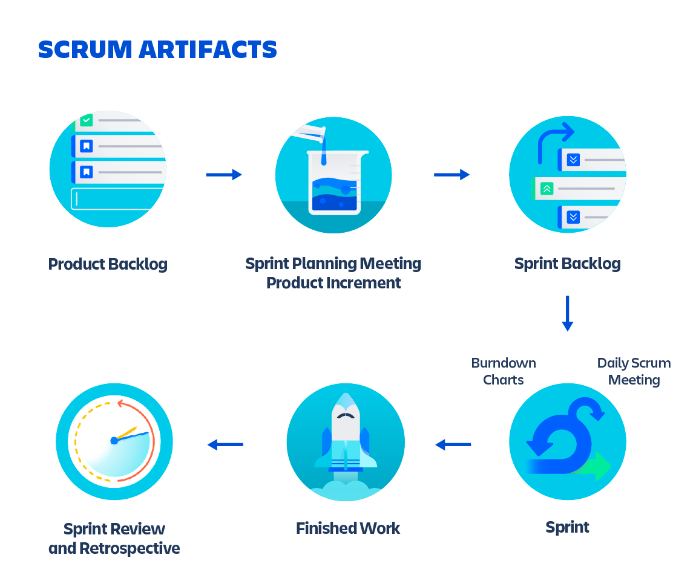

# Scrum and agile workflow

## Workflow

All the companies I worked or interviewed for said they have been using Scrum / Agile / Kanban. You may or may not have heard of it. Still, it is just a methodology, or framework companies or teams use to improve their collaboration.

### Agile

Agile is an iterative approach to project management and software development that helps teams deliver value to their customers faster and with fewer headaches. Instead of betting everything on a "big bang" launch, an agile team delivers work in small, but consumable, increments. Requirements, plans, and results are evaluated continuously so teams have a natural mechanism for responding to change quickly.

This is the terminology explanation of what Agile is. You may think it is complicated to look at, and definitely it is.
I would just briefly explain what it is and how it works.

Soooooo, Agile, in a nutshell, is a way to work in a team. It is a way to collaborate and deliver value to the customer. It is a way to work in a team and deliver value to the customer.

It targets to deliver value to the customer in small increments. It is not a big bang release. 

And by looking at different increment which has different values, we are able to prioritize what is important and what is not.

During this period there would be a lot of communication between the team and the customer. And the team would be able to respond to the changes quickly.

#### Why you need to know about Agile?

- Company in interview sometimes ask about it
- You will be working in a team when entering any company. And there is a high chance your team will use this methodology as core and other framework to extend that.
- You will be able to communicate to get the expectation of others. Therefore, work to match their expectation and get better results in general.

#### History

First, we will talk about Agile. They said it is a manifesto that a group of representatives created for many frameworks like Scrum, DSDM, Crystal, et cetera; in 2001.

Before Agile, these frameworks that help a team develop software had existed, but there was no connection or agreement. It was rare that they could agree on a set of principles called a Manifesto for Agile Software Development. You can read more about their history [here](https://agilemanifesto.org/history.html)

#### Principles

Twelve principles show compatible values based on trust and respect.

- Our highest priority is to satisfy the customer
through early and continuous delivery
of valuable software.
- Welcome changing requirements, even late in
development. Agile processes harness change for
the customer's competitive advantage.
- Deliver working software frequently from a
a couple of weeks to a couple of months, with a
preference to the shorter timescale.
- Business people and developers must work
together daily throughout the project.
- Build projects around motivated individuals.
- Give them the environment and support they need,
and trust them to get the job done.
- The most efficient and effective method of
conveying information to and within a development
the team is face-to-face conversation.
- Working software is the primary measure of progress.\
Agile processes promote sustainable development.
The sponsors, developers, and users should be able
to maintain a constant pace indefinitely.
- Continuous attention to technical excellence
and good design enhances agility.
- Simplicity--the art of maximizing the amount
of work not done--is essential.
- The best architectures, requirements, and designs
emerge from self-organizing teams.
- At regular intervals, the team reflects on how
to become more effective then tunes and adjusts
its behavior accordingly.

### Scrum

Scrum is a framework that helps teams work together. Much like a rugby team (where it gets its name) training for the big game, scrum encourages teams to learn through experiences, self-organize while working on a problem, and reflect on their wins and losses to continuously improve.

In brief, Scrum is a contracted way to make people understand other easier, and there would be ways to track it called Product Backlog.\
The whole development process is divided into Sprints. And each Sprint is a time-boxed period of time where a set of work is completed.\
There are 3 types of roles in Scrum: Product Owner, Scrum Master, and Development Team.\
There are also ceremonies called Sprint Planning, Daily Scrum, Sprint Review, and Sprint Retrospective to make people understand what is going on and what is needed to be done.

#### Why you need to know about Scrum?

- Instead of only methodology, Scrum is a framework that people apply on daily life.
- Can be applied onto any team, not only software development.
- Have many principles and lessons.
- There is certification for Scrum Master and Product Owner. You can take this to advance your role in the organization.

#### Scrum Artifacts

Agile scrum artifacts are information that a scrum team and stakeholders use to detail the product being developed, actions to produce it, and the actions performed during the project. The main agile scrum artifacts are product backlog, sprint backlog, and increments.

Artifacts are created during the main activities of a scrum sprint.

> Product Backlog\
The product backlog is a list of new features, enhancements, bug fixes, tasks, or work requirements needed to build a product.
- Is 'live' which means can be added in any time, on-demand.
- Has order which means can be prioritized.
- Only one product backlog for a project and crossed-team.
- Contain task once added in active sprint but deprioritized and moved to the backlog.

> Sprint Backlog\
The sprint backlog is a set of product backlog tasks that have been promoted to be developed during the next product increment.
- Created by development team.
- Contains tasks that are ready to be worked on.
- Include detail of the work required to create the increment.

- Created and updated during Sprint Planning.
- Smaller sprint task are assigned to relevant teams.
- The remaining undone tasks are moved to the next sprint.

> Increment\
A product increment is the customer deliverables that were produced by completing product backlog tasks during a sprint.

- Includes the increments of all previous sprints.
- Always one increment for each sprint and is decided during the scrum planning phase.
- An increment happens whether the team decides to release to the customer.
- Useful for CI/CD in version tracking or if needed, version rollback.

- Team benefit from keeping work aligned with backlog items.
- Can add reasoning for which get deploy and which is not.

> Definition of Done (DoD)\
The definition of done is a set of criteria that must be met before a product backlog item can be considered complete.

- Is defined by the organization where the team belong, and if there is not, the team will decide it.
- Ensure everyone is on the same page and know exactly what is expected.
- Ensure transparency and quality fit for the purpose of the product.

#### Roles
There are three scrum role in scrum team: Product Owner, Scrum Master, and Development Team.

You can use these terms to define which responsibility a role have:

- Product Owner: prioritize product backlog, communicate with stakeholders, and value of work from the development team.
- Development Team: create increment, self-management, and cross-functional to create increments.
- Scrum Master: educate and coach the team, remove impediments, and ensure the team is following the scrum framework. Also, serve the scrum team for a better product.

Scrum roles are not job titles, although some firms would define the title exactly as the role.\
The roles are not hierarchical, and the team members can switch roles as needed. Because the essence of scrum is empiricism, self-organization, and continuous improvement, the three roles give a minimum definition of responsibilities and accountability to allow teams to effectively deliver work. This allows teams to take responsibility for how they organize and to keep improving themselves.

> Product Owner\
> Ensure the development team deliver the most value for the organization

Their works are to tell the development what is important to deliver, represent the business.

Not only they should understand the customer but also have vision for the value the scrum team deliver to the customer.
Plus, balance the needs of the stakeholders in the organization with the work the development team can provide.

From stakeholder input to work prioritization, the product owner is responsible for the product backlog.\
Conflicting priorities and unclear directions will not only reduce the effectiveness of the team bit also could break the important trust relationship that the business has with the development team.

Their responsibilities are:
- Managing scrum backlog: They should know everything that is in the backlog and ensure it is up-to-date.
- Release management: They should know when things can and should be released.
- Stakeholder management

> Scrum Master\
> The one who hold it all together

Their role is to help the team to be effective and productive, ensuring scrum is being done well.\
They help the product owner to define value, the development team deliver the value, and the scrum team to get better.\
The scrum master is a *servant leader*.

Their responsibilities are:
- Ensuring transparency for the scrum team
- Help empiricism: Coaching the scrum team on breaking down work, describing clear outcomes and reviewing those outcomes.
- Facilitating scrum events
- Removing impediments
- Coaching the team to self-organize, and value Scrum values: Self-orgianization need help and support, encourage team to step outside the comfort zone and try different things, practices. Create the environment for 5 values of Scrum: courage, focus, commitment, respect and openness.

> Development Team\
> The development team is a group of people who can do the work of creating increments.

Therefore, not all the one on the team is a developer. It can be a tester, designer, or even a business analyst.\
The development team is cross-functional and self-organizing.\
Their responsibility is to: 
- Delivering the increment through sprint.
- Ensure transparency during sprint (Daily Standup)

#### Ceremonies

> Sprint Planning\
> Planning for sprint, create sprint backlog

**Attendees**: Development team, scrum master, product owner\
**When**: At the beginning of the sprint\
**Durations**: Usually around one hour per week of iteration. 4 hours for 1-month sprint.\
**Purpose**:
- Set up the entire team for success throughout sprint.
- Create a sprint forecast outlining how much work the team can complete.
- Creating sprint backlog.
- Flesh out intimate details of the work: stories, bugs, tasks.

> Daily Scrum
> Inform what is going on with the team.

**Attendees**: Development team, scrum master, product owner\
**When**: Once per day, typically at the same time and place.\
**Durations**: No more than 15 minutes.\
**Purpose**:
- Quickly inform everyone what is going on across the team.
- Light and fun, but informative.
- Answer the three question: what did I complete yesterday, what will I do today, and what is blocking me?

> Sprint Review

**Attendees**:\
Required: Development team, scrum master, product owner\
Optional: Project stakeholders

**When**: At the end of the sprint or milestone.\
**Durations**: Like sprint planning. 1 hour for 1-week of iteration.\
**Purpose**:
- Celebrate the accomplishment
- Demonstrate work finished
- Get feedback from stakeholders

> Sprint Retrospective

**Attendees**: Development team, scrum master, product owner\
**When**: At the end of an iteration.\
**Durations**: Typically 45 mins per week of iteration.\
**Purpose**:
- Help team understand what worked well and what didn't.
- To find out what is working so team can continue to focus on those areas. Also, to find out what is not working and use the time to find creative solutions and develop an action plan.

